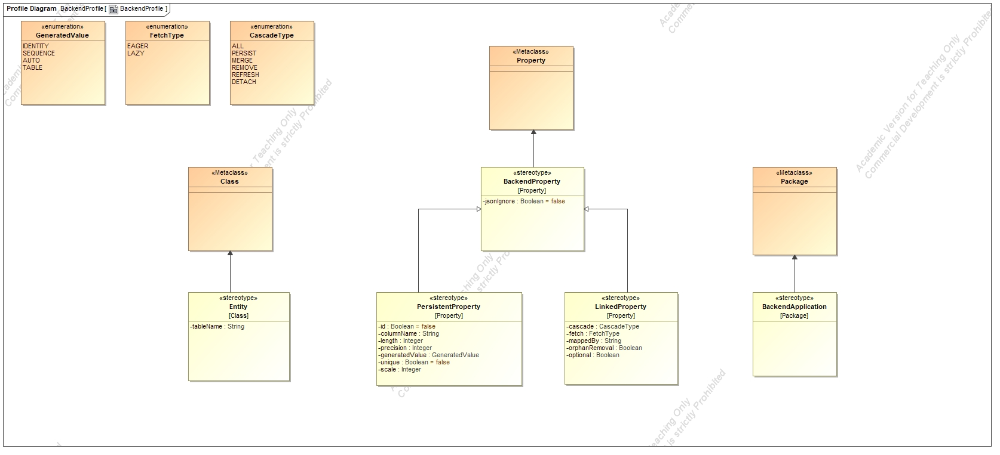
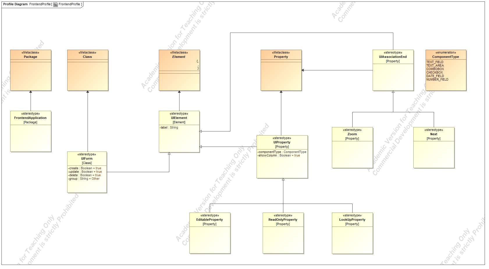

# WebAppGenerator

 

## Description

WebAppGenerator is a Java Swing application for generating web applications. 

The input for the generator is a XML representation of a UML model which uses two UML profiles: 
- BackendProfile
- FrontendProfile

The output of the generator is a web application with back-end implemented using Spring Boot and front-end implemented using HTML, CSS and JQuery.

The application was created for the purpose of the Agile Software Development Methodology course at the Faculty of Technical Sciences, University of Novi Sad.

## UML Profiles

### Backend Profile

### Frontend Profile

## Instructions

1. Import the WebAppGenerator project into your Eclipse workspace
2. Run the src/application/Application.java class
3. Choose the path for the model, the output path and additional parameters
4. Click 'Generate project'

If the generation process completes successfully, the files for the generated application will be located in the chosen output path.

## Technologies used
- MagicDraw 17.0.3 for UML models and profiles
- FreeMarker 2.3.30 for templates
- Java Swing for the application
- Eclipse IDE

## Contributors

- [Marijana Matkovski](https://github.com/matkovskim)  
- [Marijana Kološnjaji](https://github.com/majak96)  
- [Vesna Milić](https://github.com/vesnamilic)  
